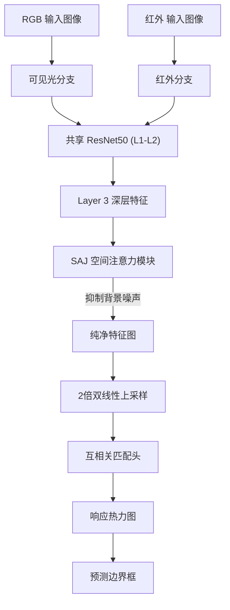

# 基于 Re-ID 特征复用的零样本跨模态行人定位
# Zero-Shot Cross-Modal Person Localization via Re-ID Feature Reuse

[](https://pytorch.org/)
[](LICENSE)
[](https://github.com/mangye16/Cross-Modal-Re-ID-baseline)


我们提出了一种 **标签高效（Label-Efficient）且免训练（Training-Free）** 的新范式。该方法复用了一个预训练好的跨模态行人重识别（Re-ID）模型，在 **无需任何检测框标注（Bounding Box Annotations）** 进行微调的情况下，实现了红外图像中的精准行人定位。

---

## 🚀 项目背景 (Motivation)

红外（Thermal）行人检测通常依赖于昂贵的边界框标注数据。为了打破 **Re-ID（重识别）** 与 **Detection（检测）** 之间的壁垒，我们致力于探索：

* **低成本标注：** 仅利用易于获取的弱标签（ID 标签），而非昂贵的强标签（检测框）。
* **零样本迁移：** 这里的“零样本”指无需针对目标检测任务进行训练或微调。
* **模态不变性：** 挖掘 Re-ID 模型在 RGB-IR 跨模态任务中学到的结构化特征。

---

## 🌟 核心特性 (Key Features)

### 1. 增强双流架构 (Augmented Dual-Stream Architecture)
我们采用改进的双流网络作为骨干，包含以下关键模块：
* **CAJ (Channel Augmented Joint Learning):** 筛选对模态变化不敏感的特征通道。
* **SAJ (Spatial Augmented Joint Learning):** **核心模块**。通过生成像素级掩码，强制网络关注人体区域并**自动抑制背景噪声**（如树木、路灯），这是解锁深层语义特征的关键。

### 2. 深层特征复用 (Deep Feature Reuse - Layer 3)
与依赖浅层几何特征（Layer 2）的 Baseline 不同，得益于 SAJ 对背景的抑制作用，我们成功解锁了 **ResNet Layer 3** 的特征。Layer 3 拥有更强的语义判别力，同时保留了足够的空间位置信息。

### 3. 空间上采样策略 (Spatial Upsampling)
为了解决深层网络下采样带来的分辨率丢失问题，我们引入了简单有效的 **2倍双线性上采样（2x Bilinear Upsampling）**，将特征步长从 16 恢复至 8，显著降低了量化误差。

---

## 📊 SOTA 实验结果 (Experimental Results)

我们在 **LLVIP** 基准数据集上进行了全量评估。实验证明，该方法在零样本设定下取得了 State-of-the-Art (SOTA) 的性能。

| 方法 (Method) | 骨干配置 | 特征层级 | 上采样 (x2) | SR@0.5 (成功率) |
| :--- | :--- | :---: | :---: | :---: |
| Baseline (ICCV21) | CAJ Only | Layer 2 | ❌ | 20.96% |
| Optimized Baseline | CAJ Only | Layer 2 | ✅ | 32.20% |
| **Ours (SOTA)** | **CAJ+SAJ** | **Layer 3** | ✅ | **48.20%** 🚀 |

> **分析：** 相比于优化后的 Baseline，我们的方法带来了 **~16%** 的绝对性能提升。这证明了在抑制背景噪声的前提下，深层语义特征比浅层几何特征更适合跨模态定位。

---

## 🛠️ 快速开始 (Getting Started)

### 1. 环境依赖
代码基于 PyTorch 构建。请安装以下依赖库：

```bash
pip install torch torchvision numpy opencv-python pillow tqdm

```

### 2. 数据与权重准备

* **数据集：** 请下载 [LLVIP Dataset](https://github.com/bupt-ai-cz/LLVIP)。
* **模型权重：** 您需要训练好的 PAMI23 Re-ID 权重文件。
* 请将您的权重文件（例如 `best.t`）放置在 `PAMI23_Supervised/save_model/` 目录下。


### 3. 目录结构

请确保您的项目目录结构如下所示：

```text
Project_Root/
├── ICCV21_CAJ/                # Baseline 代码 (基于 MangYe)
├── PAMI23_Supervised/         # 本项目核心代码 (包含带 SAJ 的 model.py)
│   └── save_model/
│       └── best.t             # 您的预训练权重
├── detection.py               # 最终的推理脚本
├── run_benchmark.py           # 比较不同网络，不同层级，是否上采样的效果
└── README.md

```

### 4. 运行 SOTA 推理

运行以下命令即可复现 48.20% 的结果并生成可视化图片：

```bash
python detection.py

```

* **指标输出：** 脚本会将 `mIoU`、`SR@0.5` 和 `平均耗时` 输出到控制台及 `sota_metrics.log` 日志文件中。
* **可视化结果：** 检测结果图片（包含 RGB 模板和红外检测框）将保存在 `sota_viz_result/` 文件夹中。

---

## 🧩 网络流程概览 (Pipeline)



---

## 👏 致谢 (Acknowledgements)

本项目基于优秀的开源仓库 **Cross-Modal-Re-ID-baseline** 进行开发。特别感谢原作者的工作：

* **代码库：** [mangye16/Cross-Modal-Re-ID-baseline](https://github.com/mangye16/Cross-Modal-Re-ID-baseline)
* **相关论文：**
* *Channel Augmented Joint Learning for Visible-Infrared Recognition (ICCV 2021)*
* *Augmented Dual-Stream Network for Cross-Modal Retrieval (TPAMI 2023)*


我们严格遵守原仓库的开源协议。如果您使用了本项目的代码，也请考虑引用上述原始论文。

---

## 📧 联系方式

如果您对本项目有任何疑问，欢迎提交 Issue 或联系作者。

